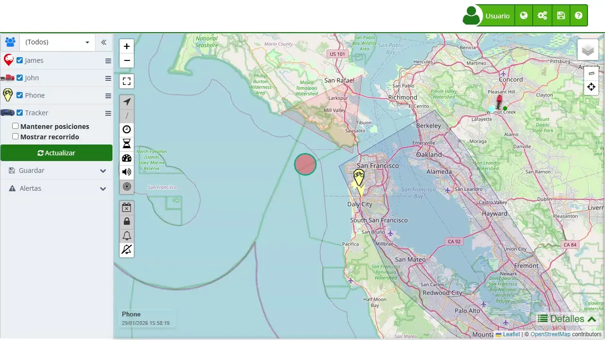

# Usuarios
En la sección de "[*fa-user* Usuarios](https://app.plaspy.com/Users)" de la aplicación, podrás gestionar las cuentas de usuario que tienen acceso a la plataforma. Esta funcionalidad es esencial para otorgar y administrar permisos, roles y accesos a diferentes usuarios según sus necesidades y responsabilidades dentro del sistema.

Para acceder a la sección de usuarios, dirígete al menú superior derecho y selecciona el ícono de engranajes \(*fa-cogs*\). En el menú desplegable, selecciona "[*fa-user* Usuarios](https://app.plaspy.com/Users)". Esto te llevará a la página donde podrás ver la lista de usuarios actuales y realizar diversas acciones como crear, editar o eliminar usuarios.

### Descripción de Campos

- **Nombre**: Permite ingresar el nombre completo del usuario. Es importante para identificar al usuario dentro de la plataforma.
- **Usuario**: Define el nombre de usuario que utilizará para iniciar sesión en la plataforma. Este campo es único y no se puede cambiar una vez creado.
- **Contraseña**: Establece la contraseña del usuario. Se debe confirmar la contraseña para evitar errores de ingreso.
- **Confirmar**: Campo para volver a ingresar la contraseña y confirmar que se ha escrito correctamente.
- **País**: Selecciona el país de residencia del usuario. Esto puede influir en la configuración regional y de idioma.
- **Zona Horaria**: Define la zona horaria del usuario. Es crucial para la correcta sincronización de eventos y alertas en el sistema.
- **Descripción**: Añade información relevante sobre el usuario, como su rol, responsabilidades o cualquier otra nota importante.
- **Tipo**: Selecciona el tipo de usuario. Las opciones pueden incluir usuario estándar, administrador de su propia cuenta, o administrador de la cuenta principal. Cada tipo tiene diferentes niveles de permisos y accesos.
- **Privilegios**: Define los permisos específicos que tendrá el usuario, como la capacidad de editar, enviar comandos, llamar a dispositivos, etc.
- **Grupo**: Asigna al usuario a un grupo específico de dispositivos. Esto ayuda a gestionar qué dispositivos puede ver y administrar.
- **Dispositivo**: Permite asignar un dispositivo específico al usuario. Solo tendrá acceso y control sobre los dispositivos asignados.
- **Cuenta deshabilitada**: Marca esta opción si deseas desactivar temporalmente la cuenta del usuario.
- **Expira**: Establece una fecha de expiración para la cuenta del usuario. Después de esta fecha, la cuenta se desactivará 
automáticamente.

### Tipos de Usuarios

Los tipos de usuarios determinan los permisos y el alcance de las acciones que pueden realizar dentro de la plataforma. A continuación, se detallan los diferentes tipos de usuarios disponibles:

1. **Usuario Estándar**:

 - Este es el usuario básico que solo puede ver los dispositivos asignados a través de un grupo o un dispositivo específico.
 - Puede tener privilegios adicionales según lo configurado, como editar dispositivos, enviar alertas SMS, enviar comandos, entre otros.
 - No puede agregar ni eliminar dispositivos, solo puede interactuar con los dispositivos asignados.
2. **Administrador \(Administra su propia cuenta\)**:

 - Este tipo de usuario tiene control completo sobre su propia cuenta, pudiendo agregar dispositivos, usuarios y accesos temporales.
 - No tiene acceso a la cuenta principal, solo a los dispositivos y usuarios que él mismo cree.
 - Los dispositivos creados por este usuario se descuentan del límite de dispositivos de la cuenta principal.
3. **Administrador \(Administra esta cuenta\)**:

 - Tiene los mismos privilegios que el usuario principal de la cuenta.
 - Tiene acceso a todos los dispositivos y usuarios, pero no puede acceder a la facturación.
 - Este usuario puede gestionar completamente la cuenta en nombre del usuario principal.

### Privilegios del Usuario

Los privilegios de usuario definen qué acciones puede realizar un usuario sobre los dispositivos asignados. A continuación, se detallan los privilegios que se pueden configurar:

- **Comandos de llamadas telefónicas**: Aquí puedes cambiar el número autorizado para llamar al rastreador. Cuando llamas al dispositivo, este puede responder con un SMS o activar la escucha de cabina.
- **Editar**: Permite al usuario modificar los nombres, íconos, alertas y otros detalles de los dispositivos asignados.
- **Enviar alertas por SMS**: Permite al usuario configurar y enviar alertas a través de SMS para los dispositivos asignados.
- **Enviar alertas por Whatsapp**: Permite al usuario configurar y enviar alertas a través de Whatsapp para los dispositivos asignados.
- **Enviar comandos**: Permite al usuario enviar comandos a los dispositivos a través de GPRS.
- **Enviar comandos SMS**: Permite al usuario enviar comandos a los dispositivos a través de SMS.
- **Rastrear 1 teléfono:**Permite al usuario ver la ubicación y el recorrido de un teléfono asignado dentro de la plataforma.
- **Rastrear teléfonos:**Permite al usuario ver la ubicación y el recorrido de todos los teléfonos asignados dentro de la plataforma.

Estos privilegios permiten una gestión granular de lo que cada usuario puede hacer dentro de la plataforma, asegurando que solo tengan acceso a las funciones necesarias para sus roles específicos.

#### Acceso a la sección de usuarios

1. **Acceder al menú de administración**:

 - Dirígete al menú superior derecho de la plataforma.
 - Haz clic en el ícono de engranajes \(*fa-cogs*\) para desplegar el menú de administración.
2. **Seleccionar la opción "Usuarios"**:

 - En el menú desplegable, selecciona la opción "[*fa-user* Usuarios](https://app.plaspy.com/Users)".
 - Serás redirigido a la página de gestión de usuarios donde podrás ver una lista de los usuarios existentes.

#### Creación de un nuevo usuario

1. **Abrir el formulario de creación**:

 - Haz clic en el ícono de agregar \(*fa-plus*\) ubicado en la parte inferior izquierda de la página de [*fa-user* usuarios](https://app.plaspy.com/Users).
 - Se abrirá una nueva ventana con un formulario para ingresar la información del nuevo usuario.
2. **Completar los campos del formulario**:

 - **Nombre**: Ingresa el nombre completo del nuevo usuario.
 - **Usuario**: Define un nombre de usuario único para el inicio de sesión.
 - **Contraseña**: Establece una contraseña segura para el usuario y confírmala en el campo "Confirmar".
 - **País**: Selecciona el país de residencia del usuario.
 - **Zona Horaria**: Define la zona horaria correspondiente al país seleccionado.
 - **Descripción**: Añade cualquier información relevante sobre el usuario, como su rol o responsabilidades.
 - **Tipo**: Selecciona el tipo de usuario \(Usuario Estándar, Administrador de su propia cuenta, Administrador de esta cuenta\).
 - **Privilegios**: Configura los permisos específicos que tendrá el usuario, como la capacidad de editar dispositivos o enviar comandos.
 - **Grupo**: Asigna al usuario a un [grupo](groups) de dispositivos.
 - **Dispositivo**: Si es necesario, asigna un dispositivo específico al usuario.
 - **Cuenta deshabilitada**: Marca esta opción si deseas que la cuenta del usuario esté deshabilitada temporalmente.
 - **Expira**: Establece una fecha de expiración para la cuenta del usuario si es necesario.
3. **Guardar los cambios**:

 - Revisa toda la información ingresada en el formulario.
 - Haz clic en "Aceptar" para guardar el nuevo usuario.

#### Edición de un usuario existente

1. **Seleccionar el usuario a editar**:

 - En la lista de [usuarios](https://app.plaspy.com/Users), localiza el usuario que deseas editar.
 - Haz clic en el ícono de edición \(*fa-pencil-square-o*\) al lado del nombre del usuario.
2. **Modificar la información del usuario**:

 - Actualiza los campos necesarios en el formulario de edición.
 - Asegúrate de revisar y confirmar los cambios realizados.
3. **Guardar los cambios**:

 - Haz clic en "Aceptar" para guardar las modificaciones realizadas al usuario.

#### Eliminación de un usuario

1. **Seleccionar el usuario a eliminar**:

 - En la lista de [usuarios](https://app.plaspy.com/Users), localiza el usuario que deseas eliminar.
 - Haz clic en el ícono de eliminación \(*fa-trash-o*\) al lado del nombre del usuario.
2. **Confirmar la eliminación**:

 - Aparecerá una ventana de confirmación.
 - Haz clic en "Aceptar" para confirmar la eliminación del usuario.

### Validaciones y Restricciones

- **Usuario único**: El nombre de usuario debe ser único y no puede ser modificado una vez creado.
- **Contraseña**: La contraseña debe cumplir con los requisitos de seguridad establecidos por la plataforma, como longitud mínima y combinación de caracteres.
- **Campos obligatorios**: Todos los campos marcados con un asterisco \(\*\) son obligatorios y deben ser completados para poder guardar los cambios.
- **País y Zona Horaria**: Estos campos deben ser seleccionados de las listas desplegables proporcionadas para asegurar la correcta configuración regional.

### Preguntas Frecuentes

- **¿Cómo puedo recuperar la contraseña de un usuario?**
 - Para recuperar la contraseña de un usuario, el administrador de la cuenta puede restaurarla a través de la sección de edición de usuarios. Esto permitirá establecer una nueva contraseña para el usuario afectado.
- **¿Puedo cambiar el nombre de usuario una vez creado?**
 - No, el nombre de usuario es único y no puede ser modificado después de su creación. En caso de necesitar un cambio, se deberá crear una nueva cuenta de usuario.
- **¿Qué sucede cuando una cuenta expira?**
 - Cuando una cuenta expira, el acceso del usuario se desactiva automáticamente. El usuario no podrá iniciar sesión hasta que un administrador reactive su cuenta o extienda la fecha de expiración.
- **¿Puedo asignar múltiples dispositivos a un usuario?**
 - Sí, puedes asignar múltiples dispositivos a un usuario seleccionando un [grupo](groups) de dispositivos en lugar de un solo dispositivo específico. Esto permite al usuario gestionar varios dispositivos según los permisos configurados.
- **¿Qué permisos tiene un usuario estándar?** 

 - Un usuario estándar tiene acceso limitado solo a los dispositivos y funciones que se le hayan asignado. Los permisos pueden incluir la consulta de ubicaciones, edición de dispositivos, envío de comandos y alertas, entre otros, según lo configurado por el administrador.
