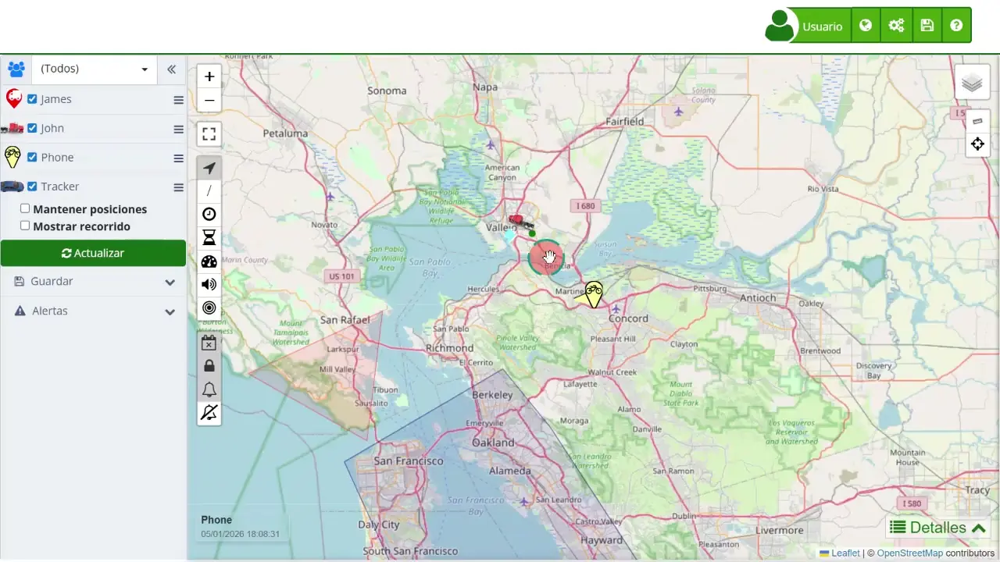

# Bienvenido a la Ayuda de Plaspy
Bienvenido al manual de ayuda de Plaspy, el servicio de seguimiento GPS satelital diseñado para ofrecer una gestión eficiente y segura de vehículos, motos, carga, teléfonos móviles y otros dispositivos rastreables. Este manual está pensado para proporcionar una guía completa sobre el funcionamiento y las ventajas del sistema Plaspy, con el objetivo de ayudar a los usuarios a maximizar el uso de esta poderosa herramienta.

Plaspy es compatible con una amplia variedad de rastreadores y ofrece aplicaciones móviles disponibles para Android y iPhone. Con Plaspy, los usuarios pueden acceder a una plataforma web integral que incluye herramientas esenciales como manejo de estadísticas, alertas, informes, sensores y accesorios, lo que permite mantener el sistema actualizado y gestionar los dispositivos de manera constante y eficiente.

### Objetivo del Manual

El objetivo principal de este manual es brindar un recurso detallado y accesible que facilite la comprensión y el uso óptimo de Plaspy. Aquí encontrará instrucciones paso a paso, guías de uso, y archivos multimedia diseñados para mejorar la experiencia del usuario al interactuar con la plataforma. Este documento es esencial para aquellos que desean aprovechar al máximo las capacidades de seguimiento y gestión de Plaspy.

### Funcionalidades Clave

Entre las principales funcionalidades de Plaspy se incluyen:

1. **[Mapa de Monitoreo en Tiempo Real](map)**: El mapa de Plaspy es una herramienta avanzada que permite visualizar de manera interactiva y en tiempo real la ubicación de diversos dispositivos rastreadores. Ofrece vistas satelitales y de calle, actualización en tiempo real, y la capacidad de analizar rutas históricas.
2. **[Panel de Control de Dispositivos](map/device_control_panel)**: Este panel facilita la gestión y visualización de todos los dispositivos rastreados. Los usuarios pueden buscar, filtrar y seleccionar dispositivos fácilmente, además de acceder a configuraciones avanzadas y opciones de visualización personalizada.
3. **[Estadísticas de Recorridos](statistics)**: Plaspy proporciona un resumen detallado del desempeño de los dispositivos durante recorridos específicos, incluyendo métricas como velocidad máxima, velocidad promedio, distancia recorrida y tiempos de movimiento y estático.
4. **[Resumen de actividades](activity_summary)**: Esta funcionalidad permite consultar de forma clara y organizada el comportamiento de los dispositivos durante un período determinado. A través de Resumen de Actividades, los usuarios pueden revisar recorridos realizados, consumo de combustible y otros indicadores relevantes, facilitando el análisis y seguimiento de vehículos o activos gestionados.
5. **[Geocercas](map/geofences)**: Los usuarios pueden crear y gestionar zonas virtuales en el mapa que generen alertas cuando un dispositivo entra o sale de dichas áreas. Estas geocercas pueden configurarse de varias formas, adaptándose a diferentes necesidades de monitoreo.
6. **[Edición Masiva de Alertas](map/bulk_alert_editing)**: Esta funcionalidad permite configurar y gestionar alertas para múltiples dispositivos simultáneamente, ahorrando tiempo y asegurando la coherencia en la configuración de alertas a través de varios dispositivos.

### Beneficios de Plaspy

Plaspy se destaca por su capacidad de proporcionar un servicio confiable, seguro, eficaz y económico, adaptado a las necesidades específicas de sus usuarios. Entre los beneficios que ofrece se encuentran:

- **Seguridad Mejorada**: Permite establecer alertas y geocercas que contribuyen a la seguridad de los activos rastreados.
- **Acceso a Datos en Tiempo Real**: Proporciona información precisa y actualizada que es crucial para la toma de decisiones informadas.
- **Flexibilidad y Adaptabilidad**: Compatible con una amplia variedad de dispositivos y adaptable a diferentes sectores y necesidades operativas.
- **Optimización de la Gestión de Flotas**: Facilita la supervisión y control de vehículos, asegurando una gestión eficiente y reduciendo costos operativos.

### Cómo Utilizar este Manual

Este manual está estructurado para ofrecer una navegación intuitiva y acceso rápido a la información necesaria. A lo largo de los capítulos, encontrará secciones dedicadas a cada una de las funcionalidades y herramientas de Plaspy, con descripciones detalladas y pasos claros para su uso. Además, se incluyen preguntas frecuentes y consejos prácticos que ayudan a resolver problemas comunes y optimizar el uso del sistema.

Esperamos que este manual sea de gran ayuda y que le permita aprovechar al máximo todas las capacidades y beneficios que Plaspy tiene para ofrecer. Si tiene alguna duda o necesita asistencia adicional, no dude en contactar con nuestro equipo de soporte, siempre dispuesto a brindar la mejor atención y servicio.

